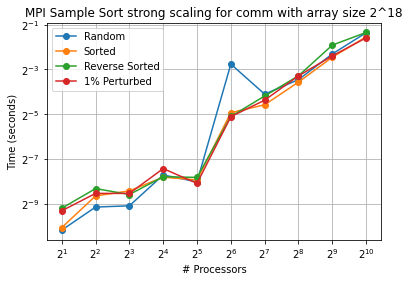
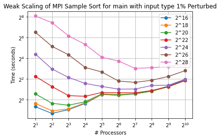
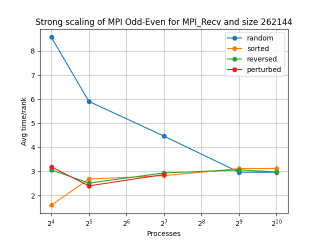
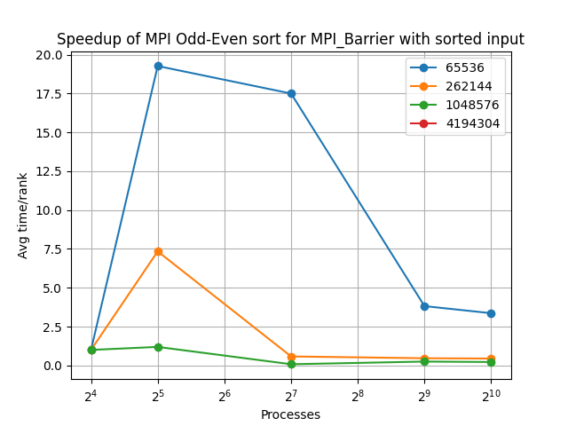
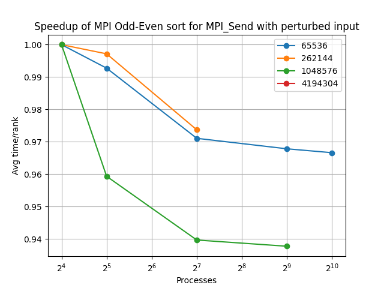
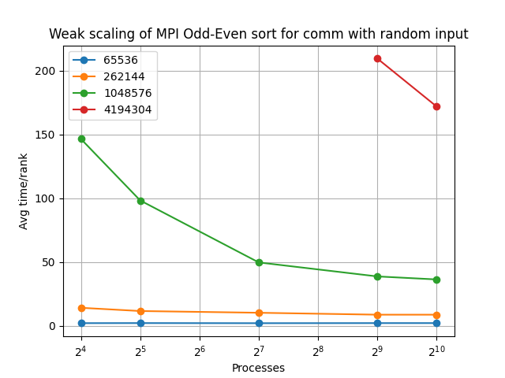
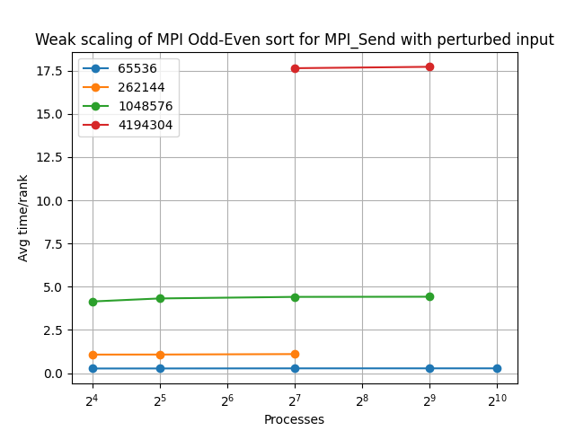
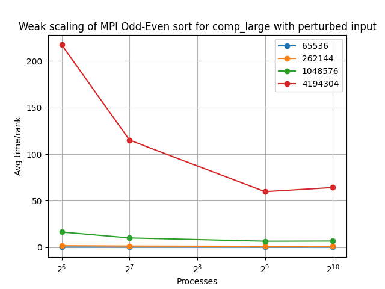
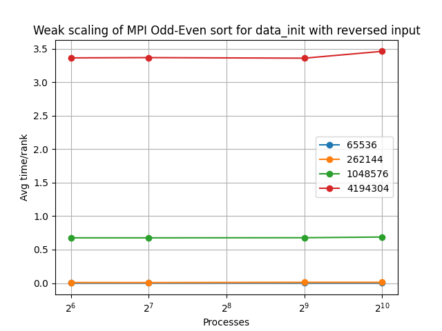

# CSCE 435 Group project

## 0. Group number: 22

## 1. Group members:
1. Joseph Buskmiller
2. Fredy Medawar
3. Shreeman Kuppa Jayaram
4. Ahsan Yahya

Communication will be by discord.

---

## 2. _due 10/25_ Project topic
Performance of different implementations of different sorting algorithms in MPI and CUDA

## 2. _due 10/25_ Brief project description (what algorithms will you be comparing and on what architectures)
- Sample Sort (MPI)
- Bitonic Sort (CUDA)
- Odd even sort (CUDA, MPI)
- Mergesort (CUDA, MPI)
- Selection Sort (CUDA)
- Radix Sort (MPI)

## 2. Pseudocode


### Radix Sort (MPI):
// Function to find the maximum value in an array
function findMaxValue(arr, n):
    max = arr[0]
    for i = 1 to n-1:
        if arr[i] > max:
            max = arr[i]
    return max

// Function to perform counting sort on a given array
function countingSort(arr, n, exp, getComparable, getIndex):
    // Assuming a constant RANGE for simplicity
    RANGE = determineRange()
    output = new Array of size n
    count = new Array of size RANGE initialized with zeros
    
    // Convert elements for sorting
    tempArr = new Array of size n
    for i = 0 to n-1:
        tempArr[i] = getComparable(arr[i], exp)
        count[getIndex(tempArr[i], exp, RANGE)]++
    
    // Update count to get actual positions in the output array
    for i = 1 to RANGE-1:
        count[i] += count[i - 1]
    
    // Build the output array using counting sort
    for i = n-1 down to 0:
        output[count[getIndex(tempArr[i], exp, RANGE)] - 1] = arr[i]
        count[getIndex(tempArr[i], exp, RANGE)]--
    
    // Copy the sorted output back to the original array
    for i = 0 to n-1:
        arr[i] = output[i]

    // Clean up temporary array
    delete tempArr

// Function to perform parallel radix sort
function parallelRadixSort(NUM_VALS, localArray, local_size, num_procs, rank, gatherAndBroadcast, copyArray):
    start_time = getCurrentTime()
    
    // Find the maximum value in the local array
    max = findMaxValue(localArray.data(), local_size)
    
    // Create a buffer for receiving data
    receiveBuffer = new Array of size NUM_VALS
    
    // Iterate through each digit's place value
    for exp = 1 to (max / exp > 0) do:
        // Perform counting sort on the local array
        countingSort(localArray.data(), local_size, exp, getComparable, getIndex)
        
        // Gather and broadcast the sorted subarrays
        gatherAndBroadcast(localArray.data(), receiveBuffer, NUM_VALS, local_size, rank, num_procs)
        
        // Copy the received data back to the local array
        copyArray(receiveBuffer, localArray.data(), NUM_VALS)
    
    // Clean up the buffer
    delete receiveBuffer
    
    // Measure and print the total runtime
    end_time = getCurrentTime()
    
    // Print the sorted array on the root process
    if rank == 0 then:
        printRuntime(end_time - start_time)
        printSortedArray(localArray, NUM_VALS)

### Selection Sort (CUDA)
    selection_sort_step(dev_values, partitionBegin, partitionEnd)
    
        Get the thread index threadIdx.x
    
        Initialize start with partitionBegin[threadIdx.x]
        Initialize end with partitionEnd[start]
    
        If start is greater than or equal to end then Return
    
        For i from start to end - 1 do
            Initialize minIndex with i
    
            For j from i + 1 to end - 1 do
                If dev_values[j] is less than dev_values[minIndex] then
                    Set minIndex to j
    
            Swap dev_values[i] and dev_values[minIndex]
    End Function
    
    Function selectionsort(values: host float array, dev_values: device float array, NUM_VALS: int, THREADS: int, BLOCKS: int)
    
        Initialize the number of blocks with BLOCKS
        Initialize the number of threads per block with THREADS
        Initialize partitionEnd as a device unsigned int array of size NUM_VALS
        Initialize partitionBegin as a device unsigned int array of size NUM_VALS
    
        Allocate device memory for partitionEnd and partitionBegin
    
        Initialize partsize with NUM_VALS * size of unsigned int
        Set every element in partitionEnd and partitionBegin to 0 and NUM_VALS in device memory
    
        Initialize i to 0
    
        While i is less than NUM_VALS
            Launch the selection_sort_step kernel with blocks, threads, dev_values, partitionBegin, and partitionEnd
    
            Synchronize the device to ensure the kernel completes
    
            Increment i
    
        Synchronize the device again to ensure all kernels are complete
    
        Free device memory for partitionEnd and partitionBegin
    
    End Function


### Mergesort
    merge(arr, start, mid, end)
      treat start-mid and mid+1 - end as seperate lists
      parse through the lists putting the smaller value first
      after parsing is completely, fill the rest of the array with any leftover values
      
    mergesort(arr, start, end):
        if start > end 
            return
        set mid = (start+end)/2
        mergeSort(arr, start, mid)
        mergeSort(arr, mid+1, end)
        merge(arr, start, mid, end)

### Samplesort
    sample_sort(size, local values, local size, num procs, sample_size)
      create list local values list on each process

      create list sample of size sample_size

      find splitters by sampling random values in local values

      determine cutoff based on sample and add to list of cutoffs

      send determined cutoffs to other processess
      receive cutoffs from other processess

      sequentially sort cuttoffs

      create lists of values by comparing to cutoffs and add to send buffers
      send buffers to all other processess
      receive buffers from all other processess and append to local values
      
      sequentially sort local values

### Bitonic Sort:
    bitonic_sort_step(device values, j, k)
      i = index of the current thread + number of threads per block + the index of the current block
      ixj = i^j

      if ixj > i
        if i&k==0
          if device values at i > device values at ixj
            swap(i,ixj)

      if i&k!=0
        if device values at i < device values at ixj
          swap(i,ixj)

    bitonic_sort(values, device values, size, threads)
      copy values from host to device as device values

      blocks = size/threads
      for k = 2 to size, double k each iteration
        for j = half k to 0, halve k each iteration
          bitonic_sort_step(device values, j, k) call to device code

      copy device values from device to host as values

## 3. _due 11/08_ Pseudocode for each algorithm and implementation

### Sample Sort (MPI):
    sample_sort(NUM_VALS, list local_values, local_size, num_procs, rank, sample_size)
      for i = 0 to local_size
        populate local_size[i]

      sample = list of floats with size of sample_size

      if not rank 0
        for i = 0 to sample_size
          int sample_index = random index within local_size
          sample[i] = local_values at sample_index

          sequentially sort sample

          cutoff largest values in sample
      else
          cutoff = 0

      cutoffs = list of floats
      for i = 0 to num_procs
        if i is not rank
          send cutoff to rank i

          recv_cutoff
          recieve recv_cutoff from rank i
          append recv_cutoff to cutoffs
        else
          append cutoff to cutoffs

      sequentially sort cuttoffs

      list of (float, int) pairs cutoff_pairs
      for i = 0 to num_procs
        cutoff_pair = (cutoffs[i], i)
        append cutoff_pair to cutoff_pairs

      for i = 0 to num_procs
        send_buf = list of flaots
        append send_buf to send_bufs

        receive_buf = list of flaots
        append receive_buf to receive_bufs

      list of floats local_buf
      for i = 0 to local_size
        for j = num_procs - 1 to 0
          if local_values[i] >= cutoff_pairs[j].first
            if j != rank
              push local_values at i to send_bufs[j]
            else
              append local_values[i] to local_buf
            break

      clear local_values
      append all of local_buf to local_values

      for i = 0 to num_procs
        if i != rank
          send size of send_buf[i] to rank i
          receive size of recv_buf[i] from rank i

          send send_buf[i] to rank i
          receive recv_buf[i] from rank i into local_values

      sequentially sort local_values

### Bitonic Sort (CUDA):
    bitonic_sort_step(dev_values, j, k)
      i = threadIdx.x + blockDim.x * blockIdx.x
      ixj = i^j

      if ixj>i
        if i&k==0
          if dev_values[i]>dev_values[ixj]
            exchange(i,ixj)

      if i&k!=0
        if dev_values[i]<dev_values[ixj]
          exchange(i,ixj)

    bitonic_sort(values, dev_values, NUM_VALS, threads)
      copy values from host to device

      blocks = NUM_VALS/threads
      for k = 2 to NUM_VALS, k <<= 1
        for j=k>>1 to 0, j=j>>1
          bitonic_sort_step(dev_values, j, k) call to device code

      copy dev_values from device to host

### Mergesort (MPI)
    mergesort() (pseudocode in section 2)
        
    MPImergesort(arr, num_vals, num_procs)
        generate a binary tree with a leaf for every process, so that the root has value zero and for every parent, one child has the same value as the parent and one child has a new value
        node thisProcsLeaf = searchForLeaf(rank)
        destList = walkUpTree(thisProcsLeaf) 
        set work = 1
        set local_size = num_vals / num_procs
        while work == 1:
            mergesort(local_values)
            nextDest = destList.pop()
            if(nextDest == rank)
                receive a message from another processor sending this process data
                combined_vals = her_vals + local_vals
                mergesort(combined_vals, 0, local_size * 2)
                local_vals = combined_vals
            else
                send our sorted local data to the processor with rank == nextDest
                work = 0 (this process does no more computation)

            if(destList.empty())
                work = 0 (the root process has finished sorting the array)


### Mergesort (CUDA)
    mergesort() (pseudocode in section 2)
    
    CUDAmergesortStep(arr, num_vals, sectionWidth)
        set start = sectionWidth * threadID
        set end = left + sectionWidth
        mergesort(arr, start, end)

    CUDAmergesort(arr, num_vals, num_threads, num_blocks)
        set sliceWidth = 2
        set threadsToUse = num_threads
        if(threadsToUse > num_vals / sliceWidth)
            threadsToUse = num_vals / sliceWidth
        if(threadsToUse < num_vals / sliceWidth)
            sliceWidth = num_vals / threadsToUse
        forever
            CUDAMergesortStep<<<num_blocks, threadsToUse>>>(arr, num_vals, sliceWidth)
            if(threadsToUse == 1)
                break
            sliceWidth *= 2
            threadsToUse /= 2

### Odd even sort (CUDA)
```
  function oddeven(data):
    for i in [0,N):
      oddeven_dev<<<blocks, threads>>>(data, i%2);

  function oddeven_dev(data, phase):
    idx = threadIdx + blockDim * blockIdx;
    if (phase==0 and idx%2==0) or (phase==1 and idx%2==1):
      if data[idx+1] < data[idx]:
        swap data at idx+1,idx
```
### Odd even sort (MPI)
```
  function rightSide(local, local_size, rank):
    Send local[rank][0] to rank-1
    receive new local[rank][0] from rank-1

  function leftSide(local, local_size, rank):
    Receive local[rank+1][0] from rank+1
    sort local[rank][-1], local[rank+1][0]
    send new local[rank+1][0] to rank+1

  function oddeven(local_data, local_size, nproc, rank):
    for i in [0,N):
      for j in [i%2,local_size):
        sort local_data[j], local_data[j+1]
      MPI_BARRIER
      if local_size%2==1:
        if i%2 == 0:
          if rank%2==0:
            rightSide(local_data, local_size, rank)
          else:
            leftSide(local_data, local_size, rank)
        else:
          if rank%2==0:
            leftSide(local_data, local_size, rank)
          else:
            rightSide(local_data, local_size, rank)
      else:
        if i%2==1:
          if rank%2==0:
            leftSide(local_data, local_size, rank)
          else:
            rightSide(local_data, local_size, rank)
      
      MPI_BARRIER
```

## 3. _due 11/08_ Evaluation plan - what and how will you measure and compare
We will evaluate the performance in terms of variable problem size and number of threads for the CUDA algorithms. We will evaluate the performance by Weak Scaling for the MPI algorithms.

## 4. Performance evaluation
### MPI Sample Sort
#### Strong Scaling
                    

### Speedup Strong Scaling
           

### Weak Scaling
           

#### Communication
Sample sort communication scaled very poorly which is expected based on how the alorithm works, especially for the non sorted input types, causing a bottleneck for the overall performance of the algorithm. This is because Sample sort sends a total of nearly num_procs^2 messages, with each process sending a buffer of values to all the other ranks. This causes the communication to take increasingly longer as more processors are added. However, for the sorted and 1% perturbed input, the increase in communication time was less drastic and didn't increase as much with more processors. This is because sample sort would send significantly less values between process when the values are sorted, as the buckets would already correspond to the values stored by each process. This applies to both the large and small communication sections. Additionally, the largest variation of communication times occured past 2^5 processess, as these jobs all used more than one node, and the position of the nodes in the tree had a significant influence on performance time. On the largest array size (2^28) with 1024 processors using 32 nodes, a considerable speedup in communication occured, likely the result of a close distribution of nodes. This means that with the ability to choose specific nodes, a much better scaling trend would appear. 

#### Computation
Sample sort computation scaled very well, especially with the larger problem sizes, and saw improvements in runtime up to 1024 processes for array sizes 2^20 and larger. It makes sense that the smaller problem sizes saw a falloff in computation improvements, as it is more likely for a process to receive a disproportionate number of values to sort on a much smaller array. However, the speedup was very consistent with the larger input sizes and took advantage of all the additional parallelization to the highest processor count. For the sorted and 1% perturbed inputs, the computations times were much faster overall (although with similar scaling) since the distribution of values is more likely to be uniform.

#### Overall
While sample sort did see considerable improvements in runtime with additional processors in terms of its computation sections, the communication sections of the algorithm were a significant bottleneck for its overall scaling and performance. In instances where the distribution of nodes was more favorable, the algorithm had much better results, but the scaling was overall inconsitent in some instances due its dependance on this factor.

### CUDA Bitonic sort
#### Strong Scaling
                    

### Speedup Strong Scaling
           

### Weak Scaling
           

#### Communication
The bitonic sort communication times were not affected by number of threads, which makes sense since CUDA memory copy operations do not depend on threads. However the communication times did increase with the array size, since more data is being transferred between the device and host.

#### Computation
Bitonic sort computation scaled well with increasing the number of threads, as the algorithm is able to scale without requring additional communication like an MPI algorithm would. However, between 512 and 1024 threads, the speedup was much less significant. This can be attributed to having more threads per block, causing individual threads to have less memory for their comparing and swapping operations. The computation times were mostly unaffected by input type.  


### MPI Oddeven sort
### Strong Scaling
                           

### Speedup Strong Scaling
                                        

### Weak Scaling
                                        

### Discussion
Odd even sort preforms overall poorly on the MPI implementation. This is likely due to the fact that instead of shared memory, odd even sort in MPI uses sending and receiving to communicate data between processors. Although there is relatively low bandwidth being used (2-3 sends and recieves per process each iteration), one can observe that the algorithm spends a lot of time on communication, particularly on MPI_Recv calls. While the algorithm scales well with the number of processors, it scales very poorly for the problem size due to its quadratic time complexity. Due to poor performance and limited budget, only problem sizes 2^16 to 2^22 were able to be run and analyzed. Interestingly, unlike the CUDA implementation, the MPI odd even sort seems to run slightly better for sorted and nearly sorted data. This may be due to the sequential bubble sort step, which does not need to write to already in-order data.

### CUDA Oddeven sort
### Strong Scaling
                            

### Speedup Strong Scaling
                            

### Weak Scaling
                            

### Discussion
Odd Even sort seems to be a much better fit for the CUDA model than for MPI. Odd Even sort spends very little time on communication thanks to CUDA's shared memory model. One can observe from the charts that there is scalablity with the number of processors. The algorithm scales poorly with problem size, however. This is due to the fact that odd even sort is essentially a parallel bubble sort, and therefore each process's computation has a time complexity of O(N^2/P). 

### Selection sort

Selection sort is a simple comparison-based algorithm that repeatedly selects the minimum element from the unsorted partition of the array and placing it at the beginning. Starting with a completely unsorted and no sorted partition arrays, the algorithm iterates through the unsorted part of array to find the minimum element and swapped with the first element of the unsorted subarray. The runtime without parallelization is O(n^2) where n is the number of elements in the array.

#### CUDA

The CUDA implementation for selection sort displays significant benefits from parallelization. The host function initiates the selection sort process by defining the dimensions of the CUDA grid and block, allocating memory and instantiating the partition indices, and setting the sorting step in parallel indicing all values in the original array by calling the CUDA kernel function. We successfully defined the selectioon_sort_step() CUDA Kernel function which performs one step of the selection sort algorithm on a partition of the array defined by the partition indices. Each thread in the block gets the start index of the assigned partition from the partitionBegin array and the end index to perform the selection sort as mentioned above. By sorting multiple partitions concurrently, the global minimum values across all partitions are determined collectively as the entire array is sorted.


#### Communication
With weak scaling communication, increasing the number of threads does not significantly affect the runtimes for all the input sizes. The runtimes gets tripled every time the input size is quadrupled (2^4).
With strong scaling communication, the runtimes increase for increasing threads till 2^9 threads before falling significantly for all the input types except random. 

#### Computation
With weak scaling computation, there is a general decreasing trend as the number of threads increases. There is a steeper decrease from 2^6 to 2^8 threads showing the benefits of parallelization before a gradual decrease with 
further increasing threads till 2^10 threads with diminishing returns. With strong scaling computation, I expected the types of input to minimally affect the runtimes because the selection sort has to traverse the entire local array larger than the current index before finding the minimum value. The sorted runtimes were slightly higher than the random runtimes. The runtimes dropped significantly from 2^8 to 2^9 threads with parallelization before tapering off for 2^10 threads.

### Radix Sort

#### MPI

Radix sort is a non-comparative sorting algorithm that works by distributing elements into buckets according to their digits. The findMaxValue functions iterates through the array to find the maximum value. It is used to determine the maximum value in the local array before starting the radix sort. The counting sort function is used as a subroutine in the radix sort. It sorts the array based on the specified digit 'exp'. The getComparable function is used to convert array elements for sorting, and the getIndex function is used to get the index for counting. It iterates through each digit's place value (exp) and performs counting sort on the local array. After each iteration, it gathers and broadcasts the sorted subarrays among different processes using gatherAndBroadcast. The sorted data is copied back to the local array, and this process is repeated until all digits are considered. 

While I began implementing MPI Selection Sort, the high runtime created memory issues when handling large amounts of data so I had to drop the idea and move to MPI Radix Sort. I implemented the above idea due to the runtime of O(d*(n+k)) where d is the number of digits in the maximum number, n is the number of elements in the array, and k is the range of digits (for base 10, k is 10). However, I did my best to run the implementation but could not generate CALI files and plots successfully despite repeated trying. I loved the learning process behind MPI to communicate between worker processes with the high overhead and parallelizing despite its high sequential nature.

### Mergesort

#### CUDA


 
The CUDA implementation for Mergesort displays slight gains from parallelization. For an array of size 2^16, 2^8 threads will save a thousand microseconds in sorting. In any other case, the gains are negligible. This is because most of the time is spent communicating with the GPU. I had an earlier CUDA implementation of Mergesort, which was carefully designed with an in-place algorithm for merging so that GPU threads wouldn't disrupt data which they didn't "own", but it ended being much, much too slow. I ended up adapting an implementation from someone else, they have been credited in mergesort.cu.

It's worth pointing out that the strong scaling graphs show a trend with the input types- sorted is the fastest, then reverse-sorted, then 1% perturbed, and then random. The reason why reverse-sorted input is so quickly sorted is because when two sub-arrays each of size n are being merged, if all the elements of one subarray are greater than all the elements of the other subarray, the merge will involve n comparisons. This is true of sorted and reverse-sorted input. Even 1% perturbed input would be better than random input, though- since in the worse case scenario, a merge involves 2n comparisons, which becomes a possibility with random input.

#### MPI


I'm proud of my MPI implementation of Mergesort. It works by generating a binary tree with leaves for each process, then each process walks down the tree and obtains a list of the destinations of it's original data. Then each process begins execution of a loop where it sorts it's local data, and then either sends it to another process or receives a message from another process. When it receives foreign data, it will copy that data and it's local data into a new array, and set that new array as it's local data for the next step. By the end of it, the sorted array is in the local data of process 0. For this reason, it's physically impossible for mergesort to beat an algorithm which doesn't involve gathering the data at the end. Mergesort will always gather the data in one process. I wondered why my code got progressively slower with more processes, or, why the speedup graph slopes downwards. Initially, I thought it was because my code was calling "MPI_Barrier()" in every recursive step- to ensure that the processors advanced up the tree together, and that any time, a process would only have one message in it's mailbox. I adapted the code so that when initially traversing the tree, processes not only make a list of the destinations of the data, but also a list of the sources the process should expect a message from. With that information, it was possible to have processors receives messages by rank, and I removed the MPI_Barrier() call. This did not help. This only added the initial overhead. The reason why the speedup graph slopes downwards is because of the constant array copies. Because I designed my algorithm to be minimalistic in respect to the memory, arrays are constantly allocated and de-allocated, and there are 2n float copy instructions for a recursive step of subarray size n. Hence, sorting an array with one processor involves 0 float copy instructions, which is hard to beat with parallelism. I expect that this algorithm would have moderate speedup had I prioritized that, and made it so every processor allocates the full size of the array even if it uses a tiny fraction of it.

There are advantages to this approach. Since the size of the array is constant on all processors, it could be possible to make use of some nodes with less memory and others with more. The speedup graphs for computation actually begin to trend upwards past 2^8 processors, though that speedup is still less than 1, my algorithm could see use in a computing system with many nodes which could be used for power but do not have as much memory as some of the others.

### Grouped Plots
#### MPI


From looking at the MPI algorithms together, sample sort preformed the best at larger processor counts, and saw better scaling as the number of processors increased. Mergesort started out faster than sample sort but didn't scale as well causing it to end slow at a high processor count. Finally, oddeven sort took too long to complete on the smaller processor counts, and didn't perform as well as the other sorts when it was able to complete.

#### CUDA


Oddeven sort is fast, but scales worse than Bitonic sort. Mergesort scales slightly better than Oddeven, but in general, it isn't nearly fast enough to compete with either Oddeven or Bitonic. Since Bitonic sort is both generally fast and scales very well, it is the fastest algorithm for highly parallelized usage.
